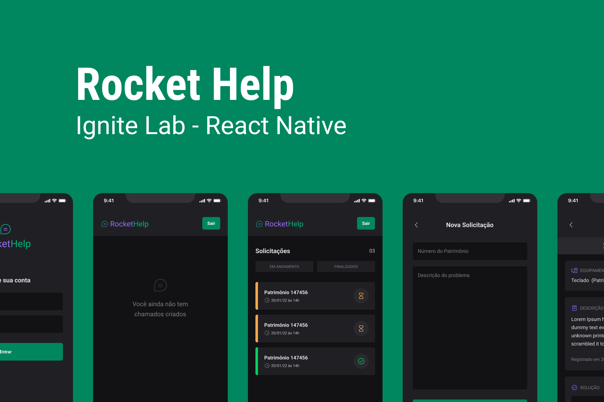

  <a href="#-tecnologias">Tecnologias</a>&nbsp;&nbsp;&nbsp;|&nbsp;&nbsp;&nbsp;
  <a href="#-projeto">Projeto</a>&nbsp;&nbsp;&nbsp;|&nbsp;&nbsp;&nbsp;
  <a href="#-layout">Layout</a>&nbsp;&nbsp;&nbsp;|&nbsp;&nbsp;&nbsp;
  <a href="#memo-licença">Licença</a>

 

  

 

  

## 🚀 Tecnologias

Esse projeto foi desenvolvido com as seguintes tecnologias:

- [React Native](https://facebook.github.io/react-native/)
- [Expo Bare workflow](https://expo.io/)
- [TypeScript](https://www.typescriptlang.org/)
- [Firebase](https://firebase.google.com/)
- [Native Base](https://nativebase.io/)

## 💻 Projeto

O Rockethelp é uma aplicação que cria chamadas para atendimentos em uma empresa,
onde o usuario pode informar o equipamento que esta com algum problema e a descrição,
assim gerando uma demanda para a equipe de suporte  

## 🔖 Layout

Nos links abaixo você encontra o layout do projeto web e também do mobile. Lembrando que você precisa ter uma conta no [Figma](http://figma.com/) para acessá-lo.

- [Layout Mobile](https://www.figma.com/community/file/1130846653327904117)

## :memo: Licença

Esse projeto está sob a licença MIT

---

Feito com ♥ by Marcos de Souza :wave: